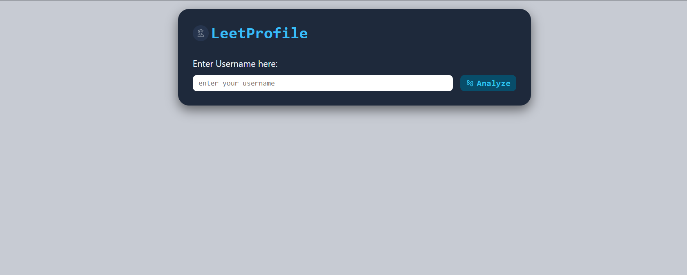

# 🧮 LeetCode Profile Tracker

Track and analyze your **LeetCode progress** in a clean, responsive dashboard.  
Built to help coders visualize their problem-solving journey and improve consistency.  

---

## 🚀 Features
- 📊 Fetch and display **LeetCode profile stats**
- 🟢 Track problems solved by difficulty (Easy / Medium / Hard)
- 📈 Interactive **progress circle & stats cards**
- 🎨 Responsive UI with modern design (works on PC & Mobile)
- ⚡ Built using only **HTML, CSS, JavaScript**

---

## 🛠️ Tech Stack
- **HTML5** – structure  
- **CSS3** – styling (with responsive design)  
- **JavaScript (Vanilla JS)** – logic and API integration  

---

## 📸 Screenshots
> 


---

## 🌐 Live Demo
[🔗 Click here to try it](https://your-live-demo-link.com)  
*(Deployed with GitHub Pages / Netlify / Vercel)*

---

## 📦 Setup Instructions

1. Clone the repository
   ```bash
   git clone https://github.com/your-username/leetcode-profile-tracker.git
   ```
2. Open the project folder
   ```bash
   cd leetcode-profile-tracker
   ```
3. Run locally  
   Just open `index.html` in your browser 🚀

---

## 📌 Roadmap / Future Improvements
- [ ] Add login/authentication with LeetCode  
- [ ] Compare multiple users’ profiles  
- [ ] Dark/Light mode toggle  
- [ ] Export stats as PDF/CSV  

---

## 🤝 Contributing
Pull requests are welcome!  
If you have ideas for new features, feel free to **open an issue**.

---

## 👨‍💻 Author
**Your Name**  
- GitHub: [@your-username](https://github.com/shivam17122002)  
- LinkedIn: [Your LinkedIn](https://linkedin.com/in/shivmpandey02)  

---
⭐ If you like this project, give it a star!  
